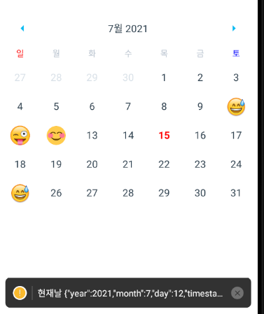
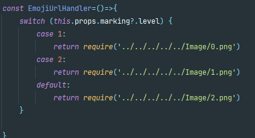

# Expo Calendar 공부 및 Expo Social 로그인 공부 (Google)

### Google
- google developer 가입 후 client id 키 생성 
### 라이브러리

- yarn add react-navigation react-native-gesture-handler
- yarn add @react-native-async-storage/async-storage
- yarn add expo-google-app-auth
- yarn add @react-native-async-storage/async-storage

### 공부

### Facebook 
- expo install expo-facebook
- 

## Calendar
- expo install expo-calendar

- node_modules/react-native-calendars/src/calendar/day/index.js (수정)

- Image 태그 source Dynamic 해결

[comment]: <> (- authentication for google signing in &#40;구글 로그인 인증&#41;)

[comment]: <> (- Dashboard for viewing who logs in )

[comment]: <> (- Startup-for auto login functionality 시작-자동로그인 기능)

